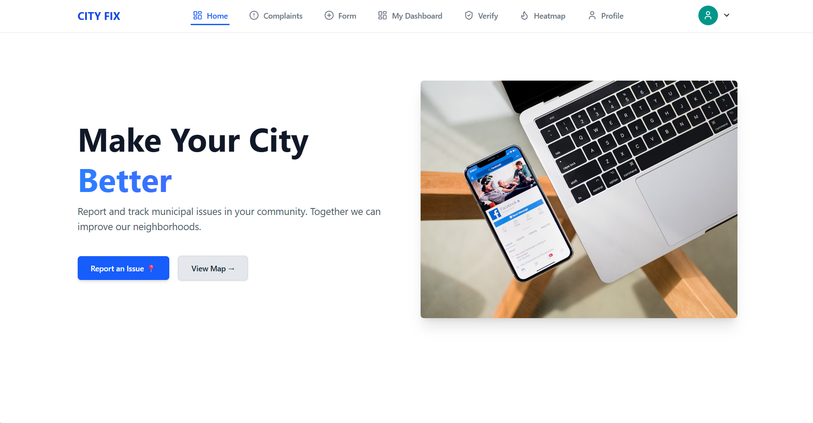
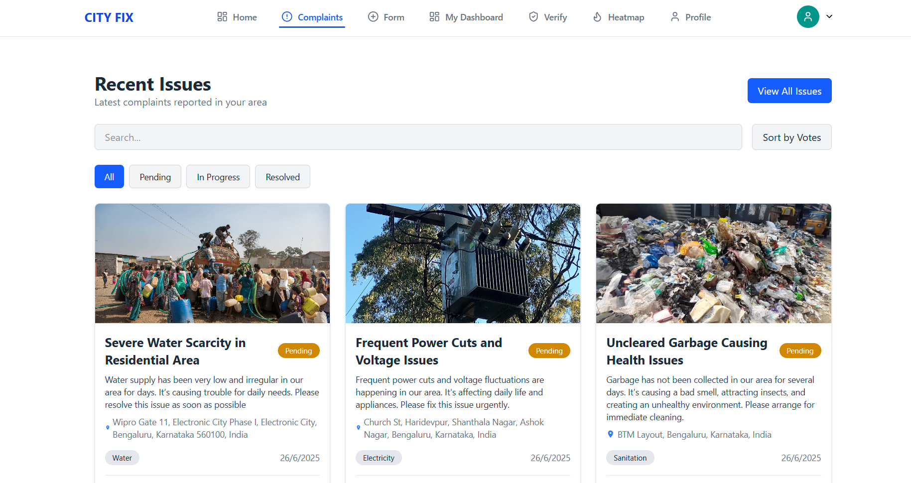
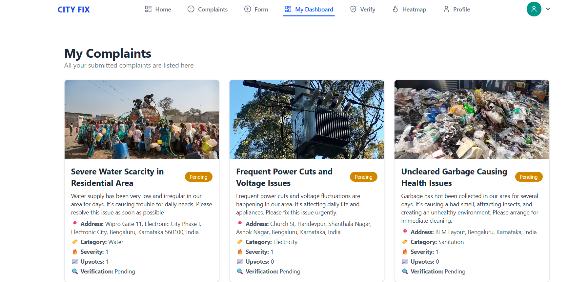
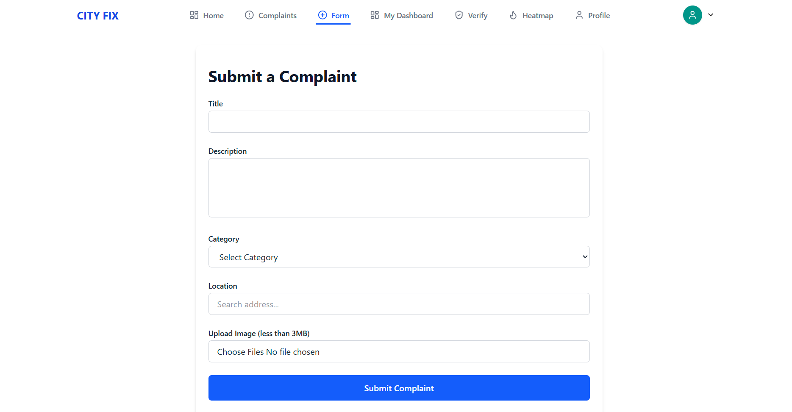
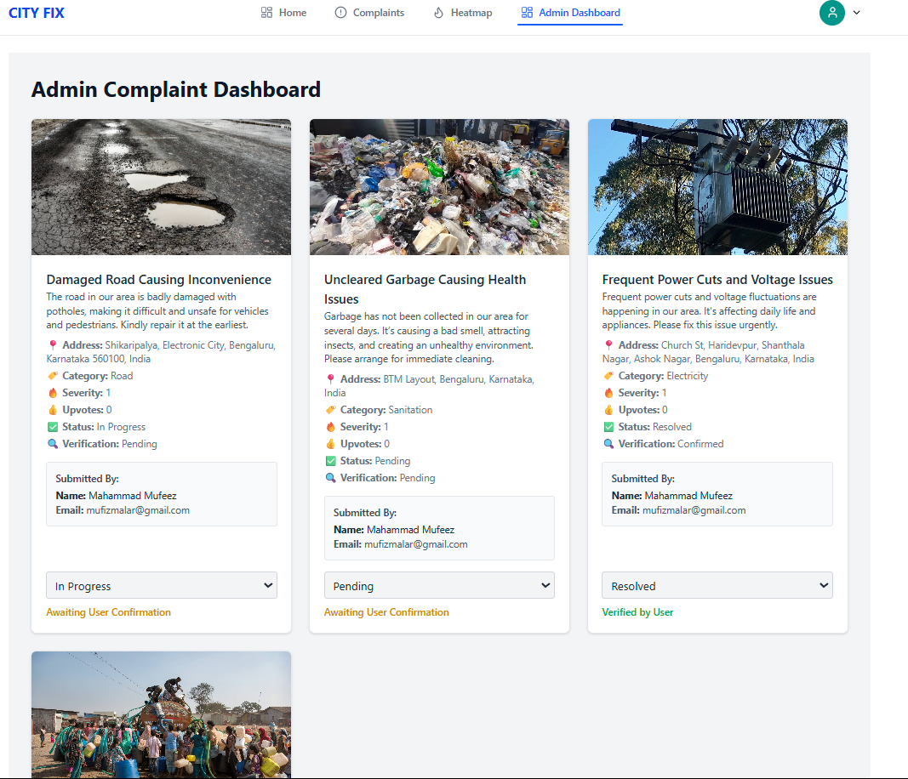
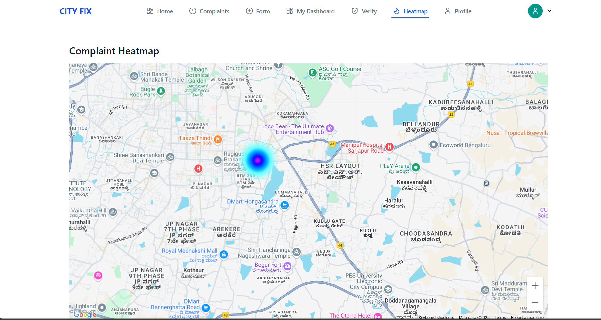
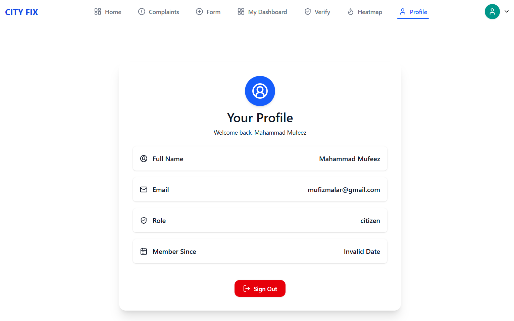

# 🏙️ SmartCity Complaint Management System

A modern, full-stack municipal complaint management system built with the MERN stack. It allows citizens to raise civic issues, while providing city administrators with tools to efficiently verify, track, and resolve them. Includes real-time heatmaps, secure dashboards, and community engagement features.

---

## 🚀 Features

- 🔐 User authentication with secure role-based access
- 📝 Submit and manage complaints by category and location
- 📊 Admin dashboard to verify, prioritize, and resolve issues
- 🗺️ Real-time complaint heatmap visualization using GeoJSON/Mapbox
- 📂 Profile page with edit and complaint history
- 📧 Email/status notifications
- 📱 Fully responsive and mobile-friendly interface

---

## 🧠 Tech Stack

### Frontend
- **React.js** + **Vite** for blazing-fast SPA
- **Tailwind CSS** for utility-first UI styling
- **Axios** for API communication
- **Mapbox** for rendering geographic heatmaps

### Backend
- **Node.js** + **Express.js** REST API
- **MongoDB** for NoSQL data storage
- **Mongoose** ODM for MongoDB
- **JWT** for secure authentication
- **Cloudinary** (optional) for image uploads

---

## 📁 Project Structure

```

cm-main/
├── backend/
│   ├── controllers/
│   ├── models/
│   ├── routes/
│   ├── middleware/
│   └── server.js
├── frontend/
│   ├── public/
│   │   └── assets/       
│   └── src/
│       ├── components/   # Reusable UI components
│       ├── pages/        # Major route-based views (Home, Dashboard, etc.)
│       ├── context/      # Auth and global state providers
│       ├── App.jsx
│       └── main.jsx

````

---

## 📸 Screenshots

Below are some of the key interface pages of the SmartCity Complaint Management System:

---

### 🏠 Homepage



> The landing page introduces the platform with a clean layout, highlighting the purpose and features of the complaint management system. Users can navigate to login, view features, and understand how the system works.

---

### 📃 Complaint List Page



> Displays a comprehensive list of submitted complaints along with their statuses, categories, and timestamps. Users and admins can filter through the list for efficient tracking.

---

### 👤 User Complaint Dashboard



> Provides each user with a personal dashboard to view and manage their submitted complaints. Users can check status updates and view complaint history in one place.

---
### 📝 Submit Complaint Form



> A simple and user-friendly form where citizens can raise their complaints by selecting the category, adding a description, uploading optional images, and providing location details. Ensures proper data capture for effective complaint resolution.

---

### 🛠️ Admin Complaint Dashboard



> The admin dashboard allows moderators to verify new complaints, assign priorities, and mark them as resolved. It ensures smooth backend control for authorities.

---

### 🗺️ Heatmap View



> Real-time heatmap displaying complaint density based on location. Helps identify problem zones in the city using geographic visualization.

---

### 📄 My Profile Page



> Shows user information, editable profile fields, and a history of user-submitted complaints. Acts as a central hub for user personalization and accountability.

---

## ⚙️ Installation & Setup

### 1. Clone the Repository

```bash
git clone https://github.com/your-username/cm-main.git
cd cm-main
````

### 2. Backend Setup

```bash
cd backend
npm install
# Add .env with MongoDB URI and JWT_SECRET
npm start
```

### 3. Frontend Setup

```bash
cd frontend
npm install
npm run dev
```

---
